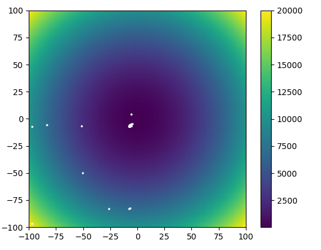

# python-genetic

Simple Implementation of a genetic algorithm. I implemented this just for fun after watching the MIT 6.034 Artificial Intelligence course (Fall 2010). You find the video about Genetic Algorithms [here](https://www.youtube.com/watch?v=kHyNqSnzP8Y&list=PLUl4u3cNGP63gFHB6xb-kVBiQHYe_4hSi&index=15&t=0s).

I think much has been said about these kind of algorithms and my algorithm is mainly to illustrate and understand the concepts. For more information navigate to the course or [Wikipedia](https://en.wikipedia.org/wiki/Genetic_algorithm).

## Prerequisites

```
pip install numpy
pip install matplotlib
```
## Genetic Algorithm



Call the algorithm for the rastrigin-function. If you choose to evaluate over two dimensions, you won'get a visualisation.
```
dims = 2
n = 100  # ~ value height
num_runs = 100
num_particles = 30
func_name = 'rastrigin'

target_array = np.zeros((num_runs, num_particles, dims))

ga = GA(num_particles=num_particles,
    dims=dims,
    max_val=n,
    step_size=.05)
ga.run(target_array=target_array, max_runs=num_runs)

vis = Particle2DVis(n=n, num_runs=num_runs)
_, background_function = generate_2d_background(func_name, n)
vis.set_background_function(background_function)

if dims == 2:
for i in range(num_runs):
    # not stopping ?
    vis.animate(solution=target_array[i, :])
    time.sleep(.1)

```